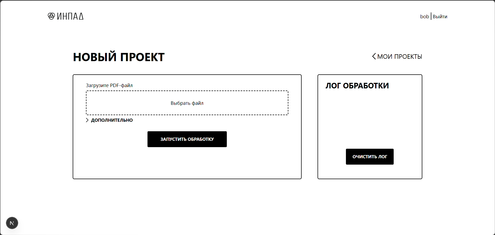
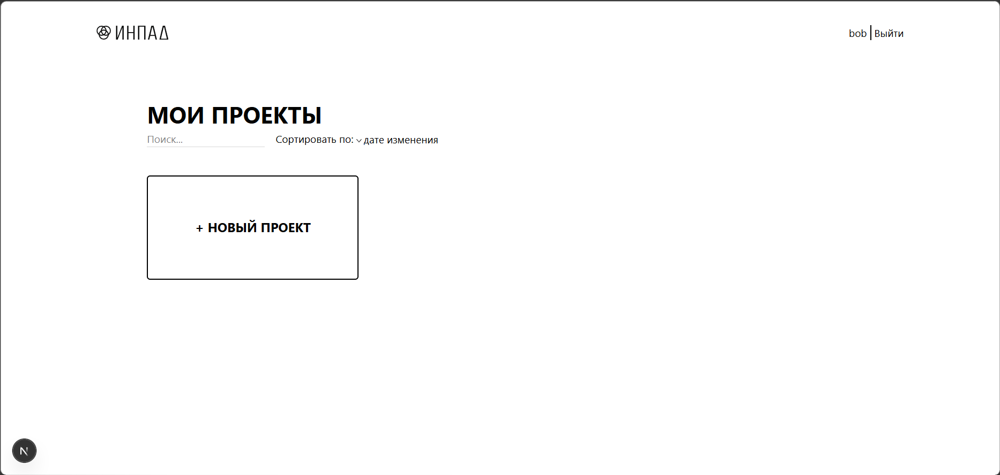

## Скриншоты





# INPAD — Воздухообмен

Веб-приложение для инженеров-проектировщиков вентиляции (ОВиК), автоматизирующее создание расчётных таблиц воздухообмена из PDF-чертежей.

## Возможности

- **Загрузка PDF** — загружайте поэтажные планы с экспликациями помещений
- **Гибкая настройка** — конфигурация параметров извлечения таблиц под каждый проект (этажи, заголовки столбцов, чувствительность распознавания)
- **Автоматическое извлечение** — Python-скрипт находит таблицы экспликаций на чертежах и извлекает данные по каждому помещению
- **Генерация Excel** — готовый файл с тремя листами:
  - **Поэтажные таблицы** — номера, наименования, площади, объёмы, расчётные расходы притока и вытяжки
  - **Системы** — сводка по системам вентиляции с 10% запасом и расчётом мощности калорифера
  - **Подборы** — шаблон для подбора оборудования с выпадающими списками
- **Управление проектами** — создавайте, переименовывайте, ищите и удаляйте проекты
- **Аутентификация** — регистрация и вход по email или username

## Технологии

**Frontend:** Next.js 16, React 19, Tailwind CSS 4  
**Backend:** Next.js API Routes  
**База данных:** SQLite (Prisma ORM)  
**Аутентификация:** better-auth  
**Обработка PDF:** Python (pdfplumber, pdfminer)  
**Генерация Excel:** Python (xlsxwriter)

## Начало работы

Установите зависимости и запустите сервер разработки:

```bash
npm install
npm run dev
```

Откройте [http://localhost:3000](http://localhost:3000) в браузере.
